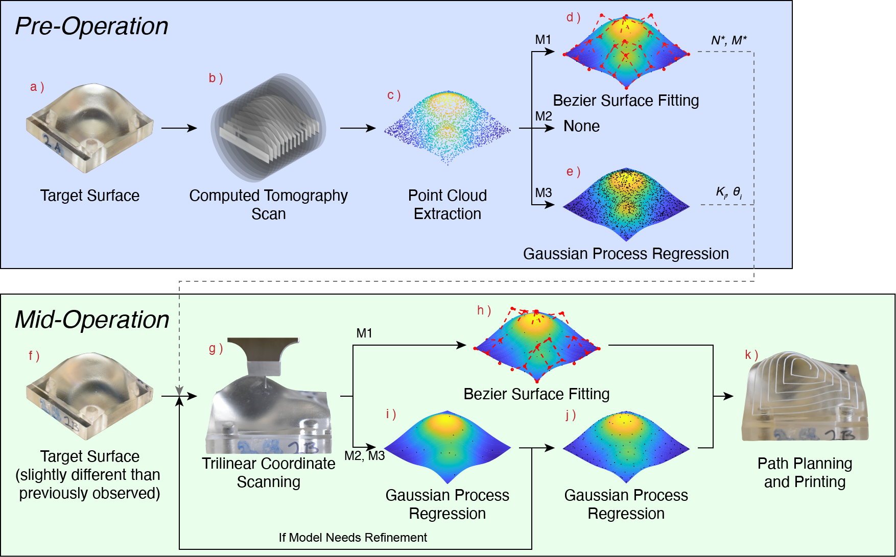

# Code for: Surface Reconstruction using Bayesian Sampling with Trilinear Coordinates Scanning for Minimally-Invasive Bioprinting
Code used to perform surface reconstruction using CT scan data and Trilinear Coordinates Scanning. Full paper available [here](doi.org)

## Requirements
- MATLAB 2024b (not tested in other versions)
- (suggested) MATLAB Parallel Computing Toolbox
- The dataset from [Harvard Dataverse](https://doi.org/10.7910/DVN/FMGSZO)

## Usage Notes
- See the dataset documentation for instructions on including the relevant data
- `Inputs.m` is used to set the parameters for simulation
- `main.m` uses the settings from `Inputs.m` to perform a simulation
- `bulksimstudy.m` can be used to run many simulations in sequence with varying parameters (*e.g.* surfaces, acquisition functions, methods, etc.)
- If the Parallel Computing Toolbox is available, it will be used to significantly accelerate simulations. It is not required, but it is highly recommended.

## Recommended Citation
Colwell, Jacob; Howard, Zyaire; Uddin, Mohammed Raihan; Hoelzle, David, 2026, "Code for: Surface Reconstruction using Bayesian Sampling with Trilinear Coordinates Scanning for Minimally-Invasive Bioprinting", https://github.com/jgreen020/BayesianOptimization_ConformalPrinting, GitHub